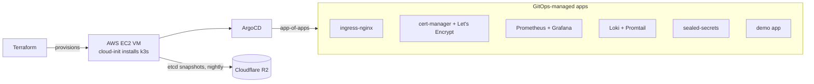

# production-cluster-in-a-box

> One command from an empty cloud account to a production-grade Kubernetes
> cluster — GitOps-managed, TLS-secured, fully observable, with automated,
> scheduled backups and a documented restore path. Runs on AWS free-plan
> credits; provider-portable by design.

<!-- demo GIF goes here (P5) -->

> **Status:** Terraform → k3s on AWS ✅ · ArgoCD GitOps loop live ✅ ·
> ingress/TLS/observability, R2 backups, and CI in progress — follow the
> [Issues](../../issues).

## Architecture



Everything after the VM exists only as YAML in this repo. ArgoCD watches
`argocd/apps/` — merging a manifest to main **is** the deployment.

## Quickstart

```bash
git clone https://github.com/Mesharimd/production-cluster-in-a-box
cd production-cluster-in-a-box/terraform
cp terraform.tfvars.example terraform.tfvars   # set your AWS profile + SSH key
terraform apply                                 # ~5 min: VM + network + k3s
cd .. && ./scripts/bootstrap.sh                 # kubeconfig + ArgoCD + root app
```

~10 minutes later: Prometheus, Loki, TLS ingress, and the demo app are live,
declarative, and reconciled by ArgoCD. Grafana also becomes ready on the
original cluster, or after its Sealed Secrets key is restored. A brand-new
cluster with a new sealing key requires the Grafana credential to be resealed;
see [docs/sealed-secrets.md](docs/sealed-secrets.md).

## What's included

| Component | Why |
|---|---|
| **k3s** (single node, embedded etcd) | Production-certified K8s in one binary, right-sized for one VM |
| **ArgoCD app-of-apps** | One root Application installs everything; `prune` + `selfHeal` on |
| **ingress-nginx + cert-manager** | Real TLS via Let's Encrypt on real subdomains |
| **kube-prometheus-stack + Loki** | Metrics, dashboards, and logs in one Grafana |
| **sealed-secrets** | Secrets live in git safely; nothing sensitive in plaintext |
| **etcd → R2 snapshots** | Nightly cluster-state backups, S3-compatible, restore documented |

## Design decisions

- **Why k3s over kubeadm:** single binary, CNCF-certified, embedded etcd
  enables built-in S3 snapshots — full production semantics without
  multi-node cost.
- **Why app-of-apps:** the cluster's desired application state is this repo,
  and drift is auto-healed. A full rebuild is `terraform apply` + bootstrap
  plus restoration of the Sealed Secrets key or resealing encrypted values.
- **Why AWS `c7i-flex.large`:** free-plan-eligible (2 vCPU / 4 GB), runs the
  full stack on new-account credits — and AWS is the provider this cluster's
  audience actually runs. The design is provider-portable, but moving to a
  fresh cluster also requires restoring or resealing cluster-bound secrets.

## Backups & restore

Fresh clusters are configured to send nightly embedded-etcd snapshots to
Cloudflare R2 through k3s's native S3 support. The existing live cluster must
be activated and verified manually with the
[P4 backup runbook](docs/p4-backups.md). The
[restore procedure](docs/restore.md) is documented but has **not yet been
tested**; the repository will not claim otherwise until an operator completes
and records a restore drill. These snapshots protect the Kubernetes datastore,
including the Sealed Secrets controller key, but not node-local volume data
such as Grafana's database.

## Teardown

```bash
terraform destroy   # removes everything; R2 bucket cleanup noted in docs
```

## Roadmap

See [Issues](../../issues) — Velero, multi-node, Istio mTLS, external-dns.

## License

MIT
