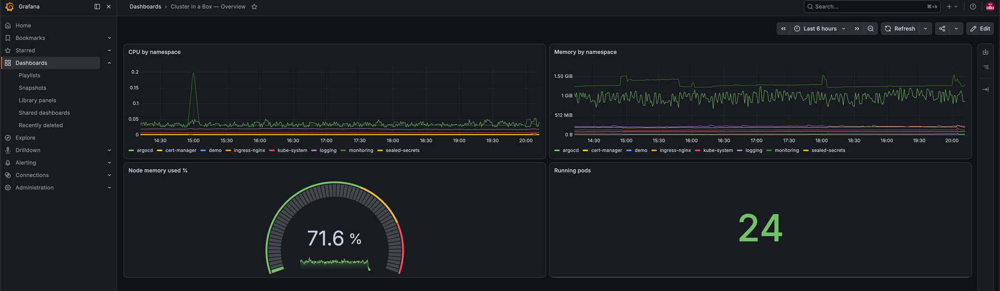
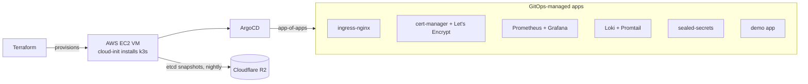

# production-cluster-in-a-box

[](https://github.com/Mesharimd/production-cluster-in-a-box/actions/workflows/ci.yml)

> One command from an empty cloud account to a production-grade Kubernetes
> cluster — GitOps-managed, TLS-secured, fully observable, with automated,
> scheduled backups and a documented restore path. Runs on AWS free-plan
> credits; provider-portable by design.

**Live right now:** [demo.meshari.xyz](https://demo.meshari.xyz) ·
[grafana.meshari.xyz](https://grafana.meshari.xyz) (login-gated) — real
Let's Encrypt certificates, served by this repo's cluster.


*The cluster watching itself: an operator-authored Grafana dashboard over
Prometheus, served with TLS from the very cluster it monitors.*

> **Status:** all core phases complete — Terraform → k3s ✅ · ArgoCD GitOps
> loop ✅ · ingress + TLS + observability + sealed-secrets ✅ · nightly R2
> backups ✅ · CI ✅. Roadmap lives in the [Issues](../../issues).

## Architecture



Everything after the VM exists only as YAML in this repo. ArgoCD watches
`argocd/apps/` — merging a manifest to main **is** the deployment.

## Quickstart

```bash
git clone https://github.com/Mesharimd/production-cluster-in-a-box
cd production-cluster-in-a-box/terraform
cp terraform.tfvars.example terraform.tfvars   # set your AWS profile + SSH key
terraform apply                                 # ~5 min: VM + network + k3s
cd .. && ./scripts/bootstrap.sh                 # kubeconfig + ArgoCD + root app
```

~10 minutes later: Prometheus, Loki, TLS ingress, and the demo app are live,
declarative, and reconciled by ArgoCD. Grafana also becomes ready on the
original cluster, or after its Sealed Secrets key is restored. A brand-new
cluster with a new sealing key requires the Grafana credential to be resealed;
see [docs/sealed-secrets.md](docs/sealed-secrets.md).

## What's included

| Component | Why |
|---|---|
| **k3s** (single node, embedded etcd) | Production-certified K8s in one binary, right-sized for one VM |
| **ArgoCD app-of-apps** | One root Application installs everything; `prune` + `selfHeal` on |
| **ingress-nginx + cert-manager** | Real TLS via Let's Encrypt on real subdomains |
| **kube-prometheus-stack + Loki** | Metrics, dashboards, and logs in one Grafana |
| **sealed-secrets** | Secrets live in git safely; nothing sensitive in plaintext |
| **etcd → R2 snapshots** | Nightly cluster-state backups, S3-compatible, restore documented |

## Design decisions

- **Why k3s over kubeadm:** single binary, CNCF-certified, embedded etcd
  enables built-in S3 snapshots — full production semantics without
  multi-node cost.
- **Why app-of-apps:** the cluster's desired application state is this repo,
  and drift is auto-healed. A full rebuild is `terraform apply` + bootstrap
  plus restoration of the Sealed Secrets key or resealing encrypted values.
- **Why AWS `c7i-flex.large`:** free-plan-eligible (2 vCPU / 4 GB), runs the
  full stack on new-account credits — and AWS is the provider this cluster's
  audience actually runs. The design is provider-portable, but moving to a
  fresh cluster also requires restoring or resealing cluster-bound secrets.
- **Why backups live on a different cloud:** the cluster runs on AWS, its
  snapshots land on Cloudflare R2 — so the backups survive anything that
  takes out the AWS side, up to and including the account itself. R2's zero
  egress also makes the worst-day restore free.

### Incidents survived during the build

Every one of these happened for real on this cluster and is fixed in the
history:

- **AWS provider v6.57 serialization bug** — intermittent
  `InvalidHttpRequest: Unable to parse request` on EC2 calls; isolated by
  proving the AWS CLI stable while Terraform flaked, fixed by pinning the
  provider to v5 (documented in `terraform/README.md`).
- **k3s TLS SAN chicken-and-egg** — the API cert is minted at install time,
  so the public IP must exist first; solved architecturally by pre-allocating
  the Elastic IP and feeding it to cloud-init (`--tls-san`), not by patching
  the box.
- **Operator TLS / admission-webhook pairing** — trimming
  `admissionWebhooks.enabled` without `prometheusOperator.tls.enabled: false`
  leaves the operator mounting a secret that never gets created.
- **OOMKilled Grafana sidecars** — 48Mi limits starved the dashboard/datasource
  loaders (exit 137); resources raised through git, pod healed by ArgoCD.
- **Grafana first-boot credential trap** — Grafana persists the admin password
  in its database on first initialization; later secret changes don't apply.
  Reset via `grafana cli admin reset-admin-password` inside the pod.
- **Operator IP rotation lockout** — SSH/kube-API are firewalled to the
  operator's home IP; when the ISP rotated it, the firewall correctly locked
  the operator out. One-variable Terraform fix.

## Backups & restore

Nightly embedded-etcd snapshots ship to Cloudflare R2 through k3s's native
S3 support (03:00 cron, 7-snapshot retention) — **active and verified on the
live cluster** (first snapshot confirmed in the bucket 2026-08-02). Fresh
clusters get the same configuration at birth via cloud-init; the live-node
activation path is the [P4 backup runbook](docs/p4-backups.md). The
[restore procedure](docs/restore.md) is documented but has **not yet been
tested**; the repository will not claim otherwise until an operator completes
and records a restore drill. These snapshots protect the Kubernetes datastore,
including the Sealed Secrets controller key, but not node-local volume data
such as Grafana's database.

## Cost

| Item | Monthly (eu-central-1) |
|---|---|
| `c7i-flex.large` (2 vCPU / 4 GB) | ~$29 |
| 30 GB gp3 root volume | ~$2.60 |
| Public IPv4 (Elastic IP) | ~$3.65 |
| Cloudflare R2 (snapshots, <1 GB) | ~$0 |
| **Total** | **~$35 — covered by AWS new-account credits for ~3 months** |

## Teardown

```bash
terraform destroy   # removes everything; R2 bucket cleanup noted in docs
```

## Roadmap

See [Issues](../../issues) — Velero (PV data), a tested restore drill on a scratch node, Grafana dashboards as GitOps ConfigMaps, Alertmanager (re-enabled for the AI incident-triage companion repo), multi-node, external-dns, and an OCI Always Free variant.

## License

MIT
